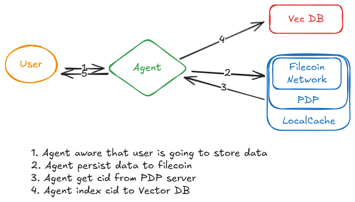
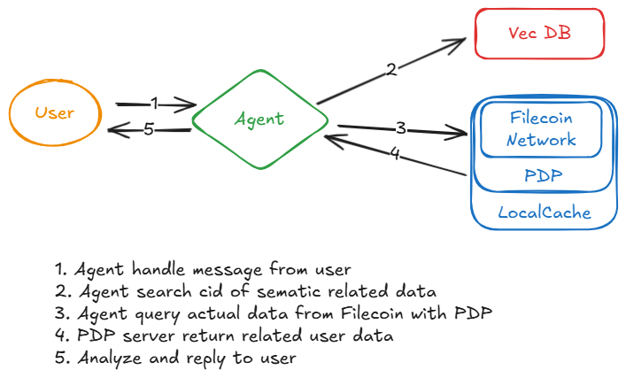
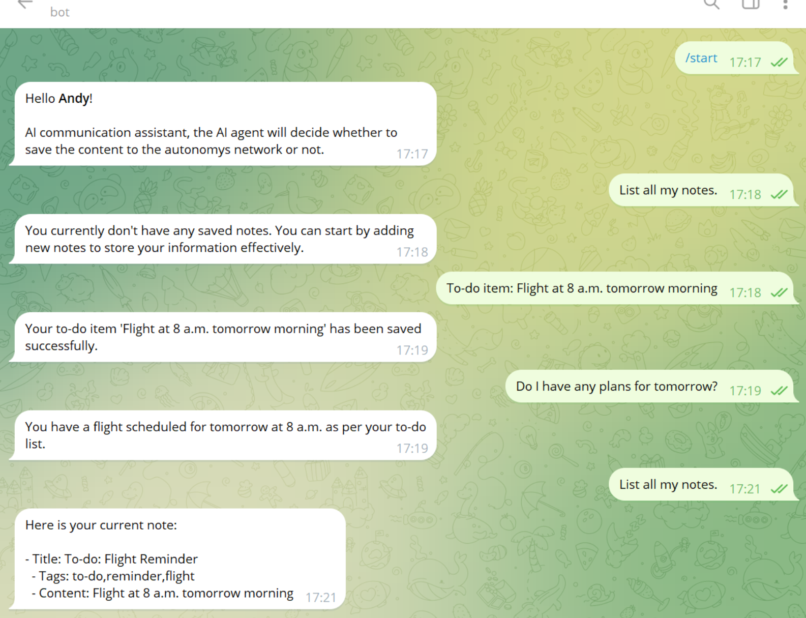

# **Filvyn: An AI Assistant Base On Filecoin**

**Filvyn** is an AI-powered personal data management agent built on the `Filecoin Network`, designed to help users securely store fragmented data, such as notes, documents, and other infomation. By leveraging the Proof of Data Possession (PDP) protocol and Filecoin's decentralized storage capabilities, Filvyn ensures long-term data persistence and efficient data processing.

With a powerful combination of AI agents and Filecoin's decentralized storage network, Filvyn enables users to store, manage, and analyze data securely. Through an intuitive interface and seamless Telegram integration, users can access personalized AI services, improving decision-making and overall productivity.

## Key Features

- **AI-powered Personal Assistant**: Utilizes natural language processing to interact with users seamlessly.
- **Decentralized Data Storage**: Ensures data availability with Filecoin's Proof of Data Possession (PDP) technology.
- **Telegram Integration**: Interact with the bot directly via [@filvyn_bot](https://t.me/bawangxiaoxuanfeng_bot).
- **Discord Integration**: Interact with the bot directly via Discord for seamless communication.

## Roadmap

While currently in the early stages, we have an ambitious vision for future features:

- Optimized Large Language Model (LLM) integration with expanded functionality:
  - Web search integration for real-time information retrieval
  - Intelligent task scheduling with priority management
  - Customizable reminder system with natural language processing
  - Enhanced semantic search across stored notes and web content
- Multi-platform support, including Discord, Slack, and Web Interfaces
- Extended support for multimedia handling (images, videos, audio)

## Structure

- Flow for persist user data



- Flow to query user data for analysis




## Change Log

- **May 23, 2025**
   - Added support for the Discord platform, providing users with more options.
- **May 29, 2025**
   - Support Secret AI to enhance data privacy protection for users.
- **Jun 10, 2025**
   - Fixed an issue with Telegram bot handling special characters by implementing MarkdownV2 character escaping, ensuring message reply stability
- **Jun 23, 2025**
   - Optimized user experience by adding timely responses and feedback to improve user experience

## Getting Started

### Using the Bot

1. Start a chat with [@filvyn_bot](https://t.me/bawangxiaoxuanfeng_bot) on Telegram.
2. The bot will assist you with AI-powered services based on your stored data.
3. Your data will be securely stored on the **Filecoin Network** via the Proof of Data Possession (PDP) protocol.

### Host the Bot by Yourself

Follow the steps below to install and run Filvyn.

#### Prerequisites

Before you start, make sure you have the following:

- **Node.js** (v16 or higher)
- **npm**
- **Access to a PDP server** for Filecoin storage integration

#### Installation

1. Clone the repository:

   ```bash
   git clone https://github.com/ipfs-force-community/filvyn
   cd filvyn
   ```

2. Install project dependencies:

   ```bash
   npm install
   ```

3. Install Chroma:

   Follow the instructions from the [Chroma Cookbook](https://cookbook.chromadb.dev/core/install/).

4. Create a `.env` file in the root directory

```bash
cp .env.example .env
# Edit the .env file to configure the necessary services
```


#### Running the Bot

##### Development Mode (Hot Reload)

To run the bot in development mode with hot reloading:

```bash
npm run dev
# Optionally, use a proxy if needed
proxychains npm run dev
```

##### Production Mode

To run the bot in production mode, follow these steps:

1. Start Chroma:

   ```bash
   chroma run --path ./data/chroma/
   ```

2. Build and start the bot:

   ```bash
   npm run build
   npm start
   ```

### Simple Demonstration


